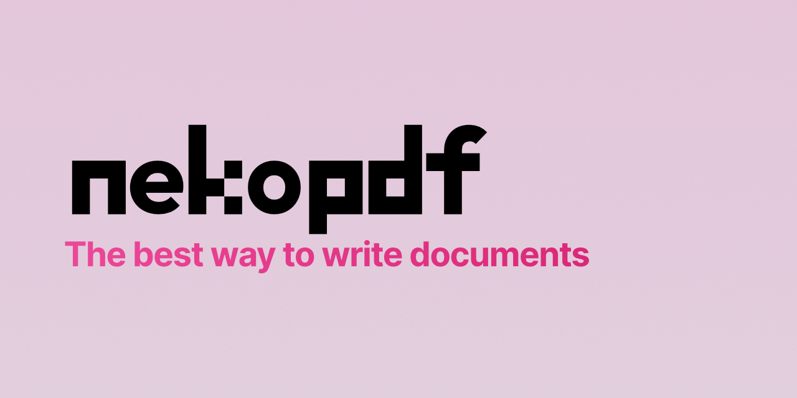

# nekopdf



> [!WARNING]  
> nekopdf is in pre-release. Several core features are missing or incomplete and bugs are to be expected. It's technically usable, but issues may arise. See [#1](https://github.com/nekopdf/nekopdf/issues/1) for a roadmap until the first stable release.

/ᐠ｡ꞈ｡ᐟ\ CLI to write PDFs using Markdown - The best way to write documents.

## Installation

```bash
npm install -g nekopdf@canary
yarn global add nekopdf@canary
pnpm add -g nekopdf@canary
bun add -g nekopdf@canary

nekopdf setup
```

## Usage

```bash
nekopdf convert README.md
```

## Options

- `-t, --theme <name>`: The theme to use. Default: `default`
- `-e, --template <name>`: The template to use. Default: `default`
- `-b, --boilerplate <name>`: The boilerplate to use. Default: `default`
- `-f, --format <name|size|width,height>`: The format to use. Default: `a4`
- `-m, --margins <name|margin|x,y|top,right,bottom,left>`: The margins to use. Default: `medium`
- `-o, --orientation <landscape|portrait>`: The orientation to use. Default: `portrait`
- `x, --modules <module,module,...>`: The modules to use. Default: `gfm,math,code`
